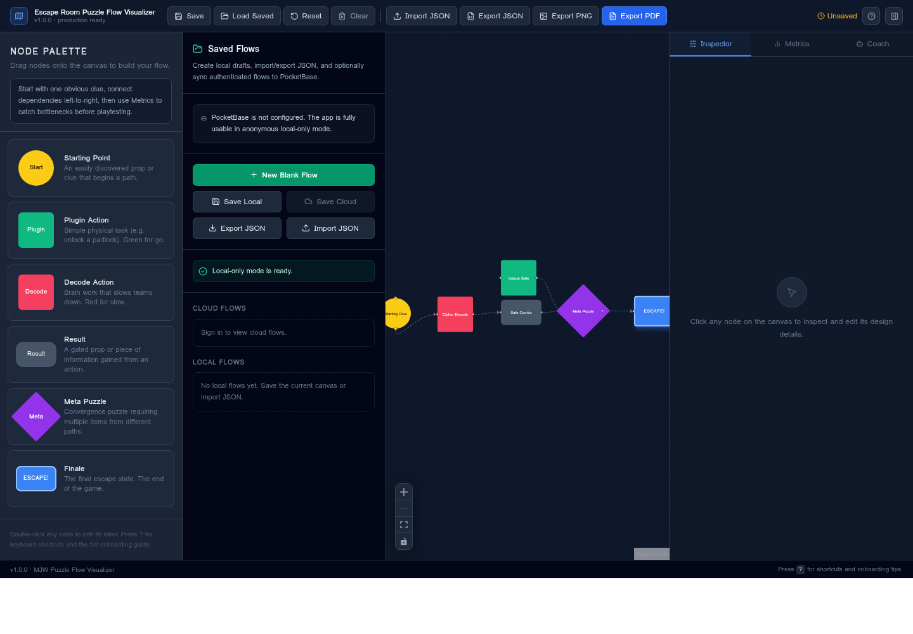
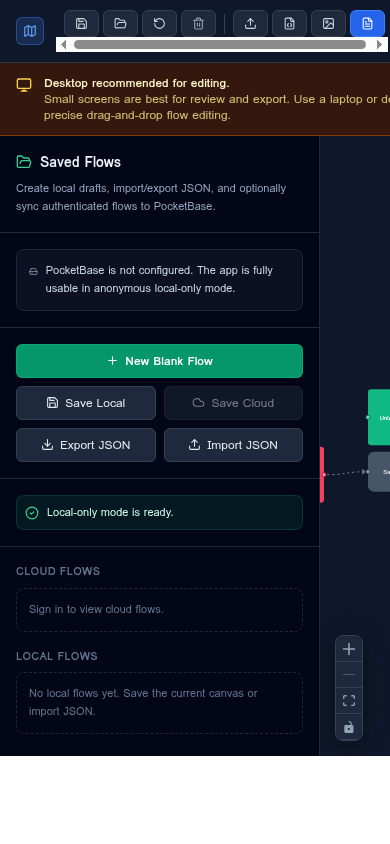

# MJW Puzzle Flow Visualizer

A premium drag-and-drop canvas tool for escape room designers. It helps design, save, export, validate, and review puzzle flows with an escape-room-specific React Flow canvas. The app includes local/offline saved flows, optional **PocketBase cloud saves**, JSON import/export, validation/inspector tooling, production onboarding guidance, and an optional **AI Flow Coach** that analyzes the current canvas through a secure Netlify Function.

## Screenshots

| Desktop Visual Editor | Mobile/Desktop Recommended State |
| --- | --- |
|  |  |

## What It Does

Unlike generic diagramming tools such as Visio or Miro, this tool uses terminology and node shapes that escape room designers already know.

| Node | Shape | Meaning |
|------|-------|---------|
| **Starting Point** | Yellow circle | A prop or clue that begins a path. |
| **Plugin Action** | Green square | Simple physical task — “green for go.” |
| **Decode Action** | Red square | Brain work that slows teams down — “red for slow.” |
| **Result** | Grey rounded rect | A gated prop or piece of info gained from an action. |
| **Meta Puzzle** | Purple diamond | Convergence point requiring inputs from multiple paths. |
| **Finale** | Blue bordered badge | The final escape state. |

**Key interactions:**

- Drag any node from the left sidebar onto the canvas.
- Draw connections between nodes by dragging from any handle.
- Double-click a node label to edit it inline.
- Use the inspector to edit design metadata such as status, solve time, difficulty, clue count, notes, props, and reset notes.
- Use the validation/metrics panel to spot missing start/finale nodes, disconnected nodes, bottlenecks, and flow-shape risks.
- Create, rename, duplicate, load, delete, import, and export saved flows.
- Export the canvas to JSON, PNG, or PDF.
- Optionally use AI coaching for pacing, bottleneck, clue-fairness, and starter-flow recommendations.

## How to Use

The app opens with an example escape-room flow so new users can see a complete path immediately. Start by dragging nodes from the left palette onto the canvas, then connect them left-to-right to model player progress. Select any node to edit its metadata in the inspector. Use metrics to find structural issues before playtesting, and use saved flows or JSON export when handing the design to another builder.

Small screens are supported for review and export, but detailed editing is intentionally marked **desktop recommended** because precise drag-and-drop, panning, zooming, and inspector editing work best on a laptop or desktop display.

## Keyboard Shortcuts

| Shortcut | Action | Notes |
| --- | --- | --- |
| `Delete` / `Backspace` | Delete selected nodes or edges | Available when focus is not inside a text field. |
| Mouse wheel / trackpad | Zoom | Provided by React Flow canvas controls. |
| Drag canvas background | Pan | Use the canvas background, not a node. |
| `Ctrl/Cmd + S` | Save current flow | Saves to local storage/autosave flow state. |
| `Ctrl/Cmd + I` | Import JSON | Opens the JSON import file picker. |
| `Ctrl/Cmd + E` | Export JSON | Downloads a portable flow JSON file. |
| `Ctrl/Cmd + R` | Reset to example flow | Prompts before replacing the current canvas. |
| `?` | Open How to Use guide | Displays onboarding tips and shortcut help. |

## Stack

| Layer | Technology |
|-------|-----------|
| UI framework | React 18 + TypeScript |
| Build tool | Vite 5 |
| Styling | Tailwind CSS 3 |
| Icons | Lucide React |
| Canvas engine | @xyflow/react (React Flow v12) |
| Exports | html-to-image + jsPDF |
| Optional cloud persistence | PocketBase |
| Optional AI backend | Netlify Functions |
| Hosting | Netlify |

## Local Development

```bash
npm install
npm run dev
```

The app works fully with **no environment variables**. Without PocketBase or AI provider variables, it runs as a local/offline browser app with localStorage saved flows and import/export support.

## Quality Checks

```bash
npm run typecheck
npm run lint
npm run build
```

## Available Scripts

```bash
npm run dev        # Start development server (http://localhost:5173)
npm run build      # Production build → dist/
npm run preview    # Preview production build locally
npm run lint       # ESLint check
npm run typecheck  # TypeScript type check (no emit)
```

## Environment Variables

All environment variables are optional unless you enable the related feature. The app remains production-usable in local-only mode with no configured variables.

| Variable | Required? | Scope | Enables | Description |
| --- | --- | --- | --- | --- |
| `VITE_POCKETBASE_URL` | Optional | Frontend/public | PocketBase sign-in and cloud saved flows | Public PocketBase/PocketHost URL used for normal user authentication and user-scoped CRUD. Example: `https://mjwdesign-core.pockethost.io`. |
| `OPENAI_API_KEY` | Optional | Netlify Function/server only | AI Flow Coach through OpenAI | Server-side OpenAI API key. Preferred provider when present. Never expose this as a `VITE_` variable. |
| `GEMINI_API_KEY` | Optional | Netlify Function/server only | AI Flow Coach through Gemini fallback | Server-side Gemini API key. Used only when `OPENAI_API_KEY` is absent. Never expose this as a `VITE_` variable. |
| `AI_MODEL` | Optional | Netlify Function/server only | AI model override | Defaults to `gpt-4.1-mini` for OpenAI or `gemini-1.5-flash` for Gemini. |
| `PB_SUPERUSER_TOKEN` | Not used by current release | Netlify Function/server only | Reserved for future privileged PocketBase operations | Do not put this in frontend code. Use only inside future Netlify Functions that perform admin tasks. |

## Saved Flows and PocketBase Cloud Saves

The app works fully with **no environment variables**. In local-only mode, saved flows are stored in browser `localStorage`, and users can still create, rename, duplicate, load, delete, import, and export flows as JSON. This preserves offline use and makes the visualizer safe to deploy before PocketBase is configured.

Cloud saves are optional. When `VITE_POCKETBASE_URL` is configured, the Saved Flows panel displays a PocketBase sign-in form. Authenticated users can save flow records to the `puzzle_flows` collection. Normal user authentication runs through the public PocketBase URL; **no PocketBase superuser token is placed in frontend code**.

### Recommended `puzzle_flows` Collection

Create a PocketBase collection named `puzzle_flows`. The current implementation expects authenticated users to own their own records through an `owner` relation field. For the MJW canonical schema, configure the following fields.

| Field | Type | Notes |
| --- | --- | --- |
| `title` | text | Display name in the Saved Flows panel. |
| `description` | editor or text | Optional project notes. |
| `owner` | relation to `users` | Should point to the authenticated user. |
| `flow_json` | json | Stores React Flow `nodes` and `edges`. |
| `thumbnail` | text or file | Text/data URL is supported by the current frontend; file upload can be added later. |
| `visibility` | select | Recommended values: `private`, `shared`, `public`. |
| `version` | number | Incremented on saves so conflicts and revision history can be handled. |
| `created` | system field | Managed by PocketBase. |
| `updated` | system field | Managed by PocketBase and used by the app for conflict checks. |

Recommended collection rules should allow authenticated users to create records for themselves and only read, update, or delete their own records. A practical rule pattern is `@request.auth.id != "" && owner = @request.auth.id` for user-scoped list/view/update/delete rules. The create rule should require authentication and an owner value matching the authenticated user.

> If a future version needs server-side admin writes, collection provisioning, cross-user sharing, or privileged migration tasks, implement those as Netlify Functions and read `PB_SUPERUSER_TOKEN` from `process.env` only inside the function.

## AI Flow Coach Setup

The AI Flow Coach is implemented through `netlify/functions/ai-flow-coach.cjs`. Browser code calls `/.netlify/functions/ai-flow-coach`; it never calls OpenAI or Gemini directly and never includes API keys in frontend code.

Configure one provider in your Netlify site settings under **Site configuration → Environment variables**. After adding environment variables, redeploy the Netlify site. If no API key is configured, the app displays a setup message instead of failing silently.

## Netlify Deployment

The `netlify.toml` at the project root configures the Vite build and static routing. To deploy on Netlify, connect this GitHub repository and use the following production settings.

| Setting | Value |
| --- | --- |
| Build command | `npm run build` |
| Publish directory | `dist` |
| Functions directory | `netlify/functions` |
| Node/package install | Netlify default Node environment with `npm install` |

```toml
[build]
  command = "npm run build"
  publish = "dist"

[[redirects]]
  from = "/*"
  to = "/index.html"
  status = 200
```

Deploy first with no environment variables to confirm the local-only app works, then add `VITE_POCKETBASE_URL` for cloud saves and AI provider variables for the AI Flow Coach if those features are needed.

## Accessibility and Production Readiness

The release UI includes accessible labels on major toolbar actions, panel tabs, import/export controls, saved-flow actions, and AI coach controls. The How to Use guide documents shortcuts and onboarding expectations, while the mobile state clearly explains that detailed editing is desktop recommended. Empty and no-configuration states are intentionally explicit so the app remains understandable before optional services are configured.

## Project Structure

```text
src/
  components/
    nodes/                    # Escape-room-specific custom React Flow nodes
    AIFlowCoachPanel.tsx      # Optional AI coaching UI
    FlowCanvas.tsx            # React Flow canvas + drag/drop wiring
    InspectorPanel.tsx        # Node metadata editor
    SavedFlowsPanel.tsx       # Local/PocketBase saved-flow manager
    Sidebar.tsx               # Node palette sidebar
    ValidationPanel.tsx       # Flow metrics and validation warnings
  lib/
    pocketbase.ts             # Optional PocketBase client wrapper
  types/
    flow.ts                   # Shared flow and saved-flow types
  utils/
    exportImage.ts            # PNG export helper
    exportPdf.ts              # PDF export helper
    flowStorage.ts            # Local autosave/import/export helpers
    graphAnalysis.ts          # Flow validation and metrics logic
    initialFlow.ts            # Starter example flow
  App.tsx                     # Root layout + toolbar
  main.tsx                    # Entry point
netlify/
  functions/
    ai-flow-coach.cjs         # Secure server-side AI provider integration
public/
  screenshots/                # README screenshots
```

## Changelog

### v1.0.0 — Production Readiness Release

- Added polished onboarding, a How to Use modal, shortcut documentation, and a visible version label.
- Added release-ready empty states, accessibility labels, focus styles, and mobile/tablet desktop-recommended guidance.
- Added README screenshots, Netlify deployment instructions, environment variable documentation, and this changelog.
- Preserved local-only operation with optional PocketBase cloud saves and optional server-side AI coaching.

### Previous Build Milestones

- Added optional AI Flow Coach through secure Netlify Functions with OpenAI-first and Gemini-fallback provider handling.
- Added local saved flows, JSON import/export, optional PocketBase cloud persistence, and conflict/version metadata.
- Added inspector, validation/metrics panels, PNG/PDF export, and escape-room-specific node types.

---

Part of the **MJW Personal App Platform**.
